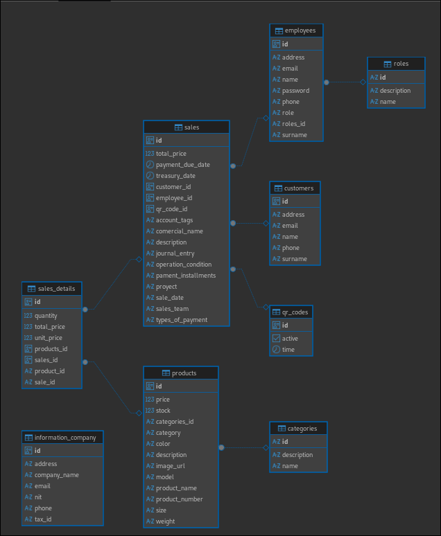

# Pasos para correr el proyecto

1. Instalar Docker en tu máquina si no lo tienes ya instalado. Puedes descargarlo desde [aquí](https://www.docker.com/products/docker-desktop).
2. Abrir una terminal o línea de comandos.
3. Ejecutar el siguiente comando para descargar la imagen oficial de PostgreSQL desde Docker Hub:

```terminal
sudo docker run --name AdventureWorksContainer -p 5050:5432 -e POSTGRES_PASSWORD=feliequipo -d postgres 
```
Después de ejecutar este comando, es necesario entrar al contenedor para crear la base de datos AdventureWorks. Para ello, ejecuta el siguiente comando:

```terminal 
sudo docker exec -it AdventureWorksContainer psql -U postgres
```
Luego, dentro del contenedor de PostgreSQL, ejecuta el siguiente comando SQL para crear la base de datos AdventureWorks:

```sql
CREATE DATABASE AdventureWorks;
```
5. Sal del contenedor de PostgreSQL escribiendo `\q` y presionando Enter.
6. Ejecutar la api de spring boot con el IDE de tu preferencia.
7. Para provar los endpoints puedes abrir el archivo `AdventureWorks.postman_collection.json` en postman o cualquier otra aplicacion para probar los endpoint
